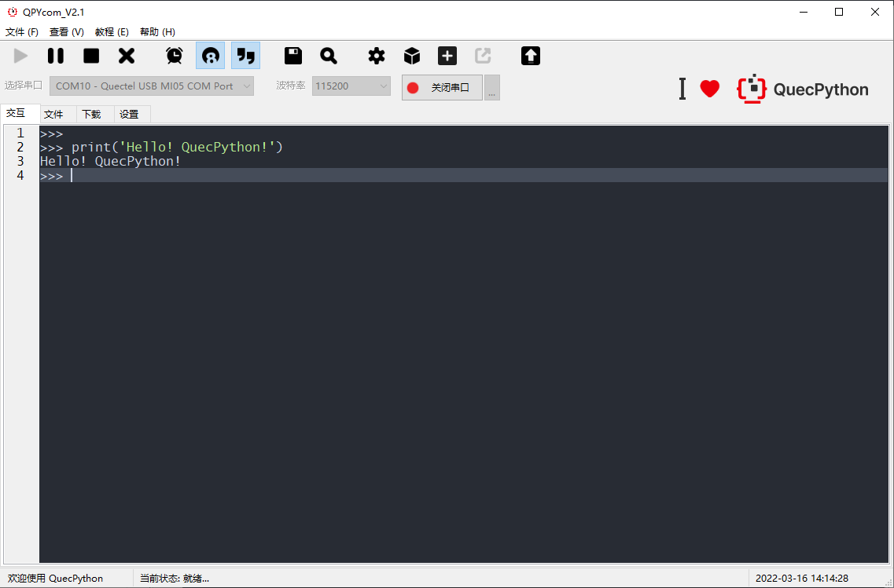

# Introduction to RS485 Gateway

[中文](README_ZH.md) | English

## Overview

- RS485 gateway, RS485 node device data collection and forwarding. This project aims to provide QuecPython developers with a RS485 gateway overall working framework, supporting modbus protocol or data passthrough, and providing rich functional templates and components to facilitate developers to apply and quickly develop RS485 gateway products.

## Functions

- RS485 node device data collection and forwarding, etc.
- Support standard modbus protocol data collection.
- data passthrough collection.
- Support multiple serial ports and multiple channels.
- Support 4G, Ethernet, WIFI and other methods of return transmission.
- Support built-in simulation server, the gateway directly processes terminal data.

## Features

- Rich components
  - With QuecPython's rich components, such as aliyun, Quectel Cloud, mqtt, etc., quickly add various component applications.
- Built-in simulator
  - Built-in simulator, single device can also be used directly.
- Multiple platform options
  - Support multiple models of products to choose.
- QuecPython secondary development, modularization, customization, shortened development cycle.

## Applications

- Industrial equipment
- Power industry
- Smart home
- Smart agriculture
- ...

## Product supporting components

### QPYcom tool

The **QPYcom** tool is a powerful tool that integrates various functions such as QuecPython repl interaction, file transfer between PC and modules, file system image creation and packaging into firmware packages, and firmware burning.

If users need to carry out secondary development, using QPYcom will greatly improve the development efficiency.

[Click here to download QPYCom tool](https://python.quectel.com/download)

For the usage documentation of QPYCom, see the `docs` folder under the installation directory.

## Advantages

- **Support various types of hardware interface connections**
  - Supports multiple hardware interface connections and uses the modbus protocol for communication. For example, if you register the i2c/spi and other interfaces through the module, you can use the modbus-protocol/passthrough mode to communicate.
- **Multiple return methods available**
  - Support 4G, Ethernet, WIFI network communication.
- **Support built-in server**
  - Internally supports simulation servers to facilitate development and debugging, and can also be used as internal offline servers to directly process terminal data.
- **Low cost development**
  - You can use Python for secondary development to reduce software development costs
  - Our multi-platform modules are applicable and developed using Python. You can quickly switch to different modules without modifying the code.
- **Strong customer service and technical support capabilities**

## Workflow of Quectel RS485 Gateway

