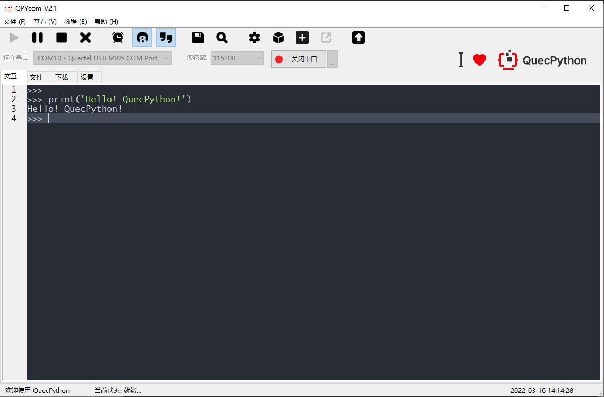
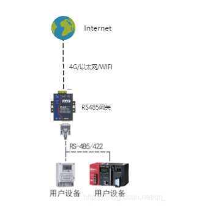

## RS485网关介绍

中文 | [English](README.md)

## 产品概述

- RS485网关，485终端设备数据采集及转发。本项目旨在为 QuecPython 开发者提供一个 RS485 网关整体的工作框架，支持 modbus 协议或者数据透传，并提供丰富的功能模板与组件，方便开发者套用并快速开发 RS485 网关产品。

## 产品功能

- RS485终端数据采集及转发等 
- 支持标准modbus协议数据采集
- 透传数据采集 
- 支持多串口多通道
- 支持4G、以太网、WIFI等多种方式回传
- 支持内置模拟服务器，网关直接处理终端数据

## 产品特点

- 组件丰富
    - 搭配 QuecPython 丰富组件，如aliyun、移远云、mqtt等，快速添加各种组件应用。
- 内置模拟器
    - 内置模拟器，单体设备也可直接使用。
- 多平台选择
    - 支持多种型号产品可供选择。
- QuecPython 二次开发，模块化、定制化、缩短开发周期

## 应用行业

- 工业设备
- 电力行业
- 智能家居
- 智慧农业
- ...

## 产品配套组件

### QPYcom工具

QPYcom工具是一个集**QuecPython repl交互、PC和模组间文件传输、文件系统镜像制作并打包到固件包、及固件烧录等各种功能**于一体的强大利器。

用户如需进行二次开发，使用QPYcom将会大大提高开发的效率。

[点此下载QPYCom工具。](https://python.quectel.com/download)

QPYCom的使用文档，参见安装目录下的`docs`文件夹。

## 产品优势

- **支持多种类型硬件接口连接**
  - 支持多种硬件接口连接，使用modbus协议进行通信，如将i2c/spi等接口，通过模块注册，即可使用modbus协议/透传方式通信。
- **可选多种回传方式**
  - 支持4G、以太网、WIFI网络通信。
- **支持内置服务器**
  - 内部支持模拟服务器，方便开发调试，也可作为内部离线服务器，直接处理终端数据。
- **低成本开发**
  - 可使用Python进行二次开发，降低软件开发成本。
  - 我司多平台模组适用，使用Python开发，无需修改代码即可快速切换至不同模组。
- **强大的客户服务和技术支持能力**

## RS485网关的工作流程

