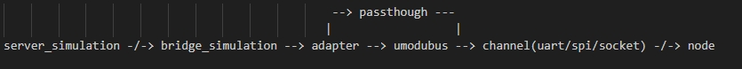

# RS485 Gateway User Application Guide

## Project Description

> The project aims to provide Python developers with an overall RS485 gateway working framework, and provide rich functional templates and components to facilitate developers to apply and quickly develop RS485 gateway products.



## Built-in Function Modules

- [x] modbus protocol (umodbus_adapter): provides universal modbus protocol conversion.
- [x] Multi-host and multi-channel: Support multi-host and multi-channel communication.
- [x] Data passthrough: Support data passthrough function.
- [x] Automatic sampling: Support sending data and automatically sampling terminal data.
- [x] Built-in simulation server (tcp_server_simulation): supports tcp server simulation, convenient and quick to use debugging.
- [x] Historical data retransmission (history): Support multi-host multi-channel communication.
- [x] Cloud service middleware (remote): Provides cloud service message processing middleware functions.
- [x] Logging module (logging): Provides log printing function.

#### Optional Components
- [x] Alibaba Cloud (aliyunIot): Provides message publishing and subscription, and OTA upgrade functions for the Alibaba Cloud IoT model.
- [x] Quectel Quecthing: Provides message publishing and subscription, and OTA upgrade functions for Quecthing IoT model.
- [x] Battery module (battery): Provides battery power setting, voltage data query, and charging status query functions.
- [x] LED module (led): provides LED switch control function and periodic flashing function.
- [x] Positioning module (location): Provides built-in/external GPS, base station, and WIFI positioning query functions.
- [x] Low power module (mpower): Provides periodic low power wake-up function.
- [x] Sensor function: Under development...

## Project Structure

```
|--code
    |--run.py
    |--tcp_server_simulation.py
    |--tcp_bridge_simulation.py
    |--collector.py
    |--control.py
    |--modbus_adapter.py
    |--global_config.py
    |--channel
        |--channel.py
        |--serial.py
    |--umodbus
        |--common.py
        |--const.py
        |--functions.py
        |--modbus.py
        |--rtu.py
        |--tcp.py
        |--typing.py
        |--version.py
    |--modules
        |--aliyunIot.py
        |--battery.py
        |--common.py
        |--history.py
        |--led.py
        |--location.py
        |--logging.py
        |--mpower.py
        |--quecthing.py
        |--remote.py
        |--sensor.py
```

### Functions Overview

#### Business Function Modules

| file | function description |
|---|---|
| collector | The collector module is mainly used to collect data from various functional modules, integrate the data and process the business logic, such as sending RS485 node device data and obtaining information from the gateway itself. |
| control | The controller module is mainly used to control the functional modules of the device, such as restarting and shutting down the power supply, sending cloud messages, etc. |
| modbus_adapter | The modbus protocol adapter module is mainly used for modbus protocol conversion and adaptation. |
| tcp_server_simulation | The server simulator module, as a built-in server, processes node device data and sends data. |
| tcp_bridge_simulation | Bridge module, built-in server and node device control bridge module, adapt to the server and lower-level data processing module |

#### Device Function Modules

| module | function description |
|---|---|
| channel | Channel abstract class, for the channel class abstracted from the Modbus protocol, inheritance can be used as a communication channel with the node device. |
| serial  | Serial port reading and writing, inherited from channel, can also be used as a channel of modbus protocol. |
| History | History file read and write operation module. |
| RemotePublish | Cloud message publishing class, used for compatible message publishing and OTA upgrade detection and confirmation on different clouds |
| RemoteSubscribe | Cloud message subscription class, used to be compatible with messages sent from different clouds. |


## Project Configuration

### Hardware Device

Recommended device

- Module: EC600NCNLA/EC600NCNLC

### Support Modbus Function Items
| Function id    |      Description     | 
|      ---       |           ---                    |
|        1       | Read coil value                  |
|        2       | Reading Input Values             |
|        3       | Read Holding Registers           |
|        4       | Read Input Register              |
|        5       | Writing a single coil value      |
|        6       | Writing a single register value  |
|        15      | Writing multiple coil values     |
|        16      | Writing multiple register values |

### Use Debugging Instructions

#### 1. Start the Gateway Service
> execute `run.py`

#### 2. Query node device data
The interactive format is shown in the following section

```python
data = '{"message_id": 100,"nodeData": {"passthrough": 0,"channel": 0,"slave": 1,"function": 3,"startAddress": 2,"quantity": 3,"scan_rate": 0}}'
server.send(data)
```


### Simulation Interaction Format Description
json format

> Control data format for communicating with node devices

| Parameter         | type    | Required | Description |
| ---         | ---     | ---    | --- |
| message_id  | INT     |   yes     | Message ID                   |
| nodeData    | str     |   yes     | Indicates the terminal data information field        |
| channel     | INT     |   yes     | Channel number. When communicating through multiple channels, you need to specify the channel number. The default value is 0. |
| scan_rate   | INT     |   no     | Sampling rate, after specifying, internally send this data acquisition information to the server at a fixed time, default is 0, the fastest query is 100ms, unit is ms |
| passthrough | 0/1     |   yes     | passthrough <br>0：non-passthrough<br> 1: passthrough |
| slave       | INT     |   no     | Slave device address, specified in non-passthrough |
| function    | INT     |   no     | Modbus function code, used in non-passthrough |
| start_address | INT     |   no    | Modbus start address, used in non-passthrough |
| quantity      | INT     |   no    | Number of modbus registers, used in non-passthrough |
| data          | INT     |   no    | Transparent data content, used in passthrough mode, to ensure data universality, base64 encoding is required |


Example 1:
```json
# In non-passthrough mode, the slave address is sent to channel 0, the slave address is read as 1, but the starting address is 2. The register value is kept for 3 consecutive times, and the query is reported once every 10 seconds.
{
  "message_id": 100,
  "nodeData": {
    "passthrough": 0,
    "channel": 0,
    "slave": 1,
    "function": 3,
    "startAddress": 2,
    "quantity": 3,
    "scan_rate": 10000
  }
}
```
Example 2:
```json
# Transparent transmission mode, send data to channel 0
{
  "message_id": 101,
  "nodeData": {
    "passthrough": 1,
    "channel": 0,
    "data": "AQMAAgADpAs="
    "scan_rate": 0
  }
}
```

> Ack data format for communicating with node devices

| Parameter   | Type    | Required | Description  |
| ---         | ---     | ---    |--- |
| message_id  | INT     |   yes     | Message ID    |
| response    | INT     |   no     | Reply Code     |
| desc        | str     |   no     | Response Description |
Example:
```json
# non-passthrough mode, send data to channel 0
{
  "message_id": 101,
  "response": 0,
  "desc": "success"
}
```

> Reporting data format for communication with node devices

| Parameter   | Type    | Required | Description  |
| ---         | ---     | ---    |---  |
| report      | INT     |   yes     | Message ID                   |
| channel     | INT     |   yes     | Channel number. When communicating through multiple channels, you need to specify the channel number. The default value is 0.  |
| passthrough | 0/1     |   yes     | passthrough <br>0：non-passthrough<br> 1: passthrough|
| slave       | INT     |   no     | Slave device address, required for non-passthrough|
| function    | INT     |   no     | Modbus function code, required for non-passthrough |
| start_address | INT     |   no   | Modbus start address, required for non-passthrough |
| quantity      | INT     |   no   | Number of modbus registers, required for non-passthrough |
| value         | value   |   yes   | node device data content, which is the node device response base64 encoded data in passthrough mode|
Example 1:
```json
# In non-passthrough mode, the slave address is sent to channel 0, the slave address is read as 1, but the starting address is 2. The register value is kept for 3 consecutive times, and the query is reported once every 10 seconds.
{
  "report": {
    "passthrough": 0,
    "channel": 0,
    "slave": 1,
    "function": 3,
    "startAddress": 2,
    "quantity": 3,
    "value": "xxx"
  }
}
```
Example 2:
```json
# Passthrough mode, send data to channel 0
{
  "report": {
    "passthrough": 1,
    "channel": 0,
    "value": "xxx"
  }
}
```
